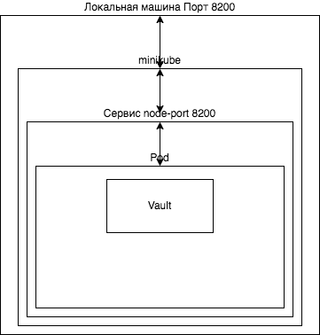

University: [ITMO University](https://itmo.ru/ru/)
Faculty: [FICT](https://fict.itmo.ru)
Course: [Introduction to distributed technologies](https://github.com/itmo-ict-faculty/introduction-to-distributed-technologies)
Year: 2023/2024
Group: K4112c
Author: Timonenko Nikolay Alexandrovich
Lab: Lab1
Date of create: 30.09.2023
Date of finished:

## Лабораторная работа №1 "Установка Docker и Minikube, мой первый манифест."
### Цель работы
Ознакомиться с инструментами Minikube и Docker, развернуть свой первый "под".
### Ход работы
Запуск minikube cluster
```
minikube start
```
  
Создание "пода" с использованием файла HashiCorpVault-pod
```
kubectl create -f HashiCorpVault-pod.yml 
```
Содержание манифеста
```
apiVersion: v1
kind: Pod
metadata:
  name: vault
  namespace: default
  labels:
    app: vault
spec:
  containers:
  - name: vault
    image: hashicorp/vault

```
Создание сервиса и проброс порта 8200 сервиса на порт 8200 локальной машины
```
minikube kubectl -- expose pod vault --type=NodePort --port=8200
minikube kubectl -- port-forward service/vault 8200:8200
```

После указанных действий хранилище доступно по адресу [http://localhost:8200](http://localhost:8200), однако для доступа нужно найти токе в логах:
```
minikube kubectl -- logs vault
```


### Ответы на вопросы
- Что сейчас произошло и что сделали команды указанные ранее?

Создание "пода" на основе манифеста и образа HashiCorpVault, создание сервиса и соотнесение портов

-  Где взять токен для входа в Vault?

В логах "пода".

### Схема
