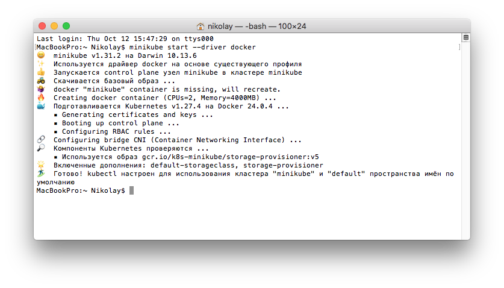
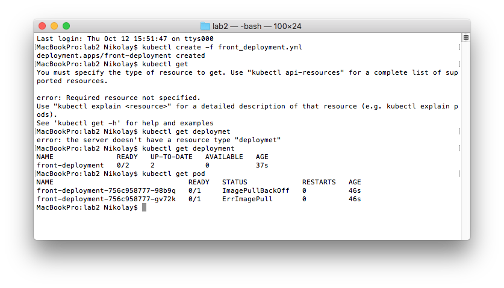
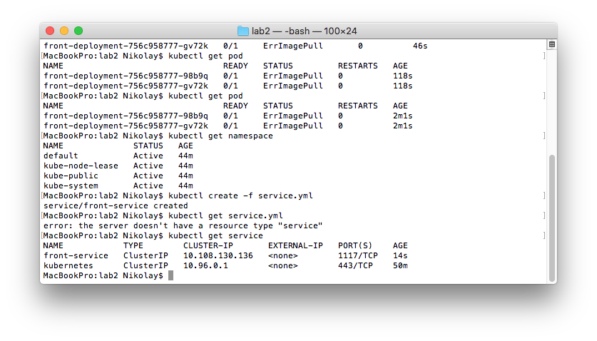
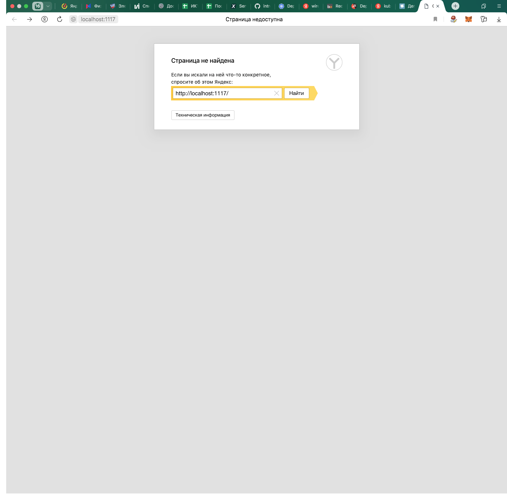
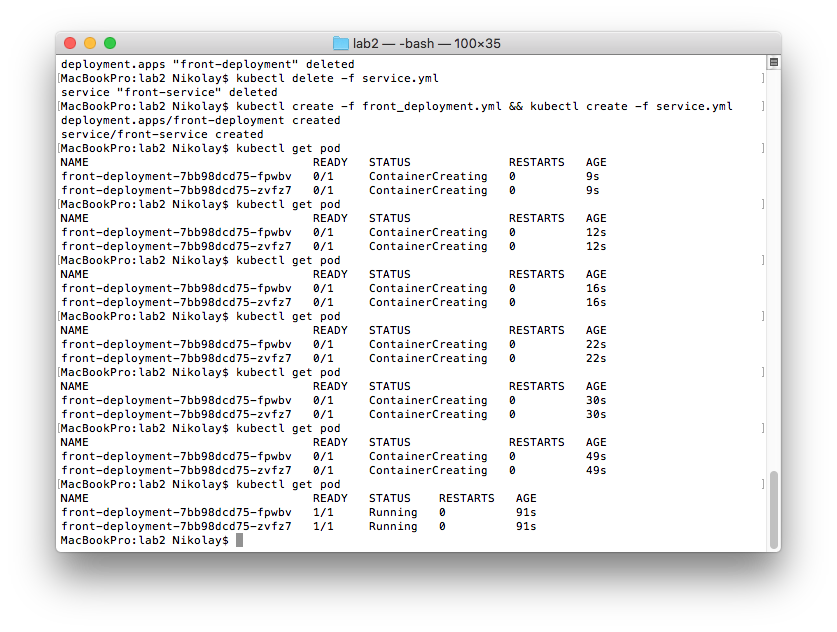
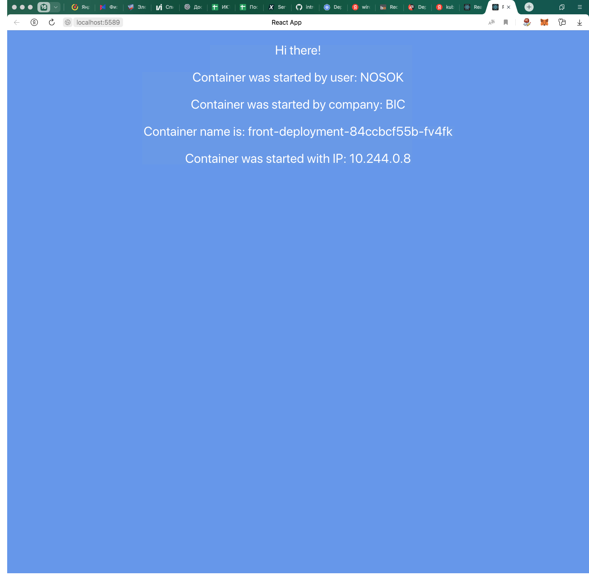
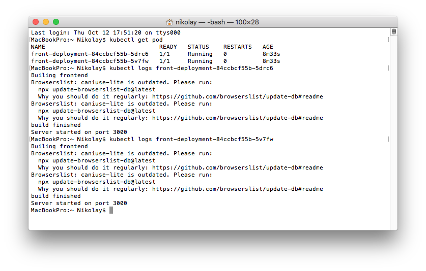
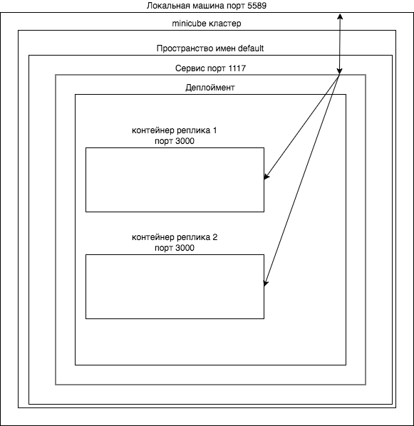

University: [ITMO University](https://itmo.ru/ru/)
Faculty: [FICT](https://fict.itmo.ru)
Course: [Introduction to distributed technologies](https://github.com/itmo-ict-faculty/introduction-to-distributed-technologies)
Year: 2023/2024
Group: K4112c
Author: Timonenko Nikolay Alexandrovich
Lab: Lab2
Date of create: 12.10.2023
Date of finished:

## Лабораторная работа №2 "Развертывание веб сервиса в Minikube, доступ к веб интерфейсу сервиса. Мониторинг сервиса.""
### Цель работы
Ознакомиться с типами "контроллеров" развертывания контейнеров, ознакомится с сетевыми сервисами и развернуть свое веб приложение.
### Ход работы
Запуск minikube cluster с драйвером docker
```
minikube start --driver docker
```

Создадим deployment на основе манифеста. В манифесте указываем образ для контейнера, количество реплик - 2, передаем значения для переменных и значение порта контейнера. После создания проверяем наличие деплоймента и двух реплик контейнера.
```
kubectl create -f front_deployment.yml 
```

```
apiVersion: apps/v1
kind: Deployment
metadata:
  name: front-deployment
  labels:
    app: front-deployment
spec:
  replicas: 2
  selector:
    matchLabels:
      app: nginx-deployment
  template:
    metadata:
      labels:
        app: nginx-deployment
    spec:
      containers:
      - name: front
        image: ifilyaninitmo/itdt-contained-frontend
        env:
        - name: REACT_APP_USERNAME
          value: "NOSOK"
        - name: REACT_APP_COMPANY_NAME
          value: "BIC"
        ports:
        - containerPort: 3000
```
Для доступа к контенерам Сервис с пробросом порта 1117 на порт 3000 контейнера
```
kubectl create -f service.yml
```
```
apiVersion: v1
kind: Service
metadata:
  name: front-service
spec:
  selector:
    app: front
  ports:
  - protocol: TCP
    port: 1117
    targetPort: 3000
```

После этого контейнер должен быть доступен по адресу [http://localhost:1117](http://localhost:1117), онако получаем ошибку - страница не найдена.

На скриншотах выше, видим, что есть ошибка при получении образа.
Удаляем деплоймент:
```
kubectl delete -f front_deployment.yml
```
Вносим исправление с манифест деплоймента:
```
  selector:
    matchLabels:
      app: front
  template:
    metadata:
      labels:
        app: front
ifilyaninitmo/itdt-contained-frontend:master
```
Пересоздаем деплоймент и сервис и убеждаемся, что контейнеры запущены.
```
kubectl create -f front_deployment.yml && kubectl create -f service.yml
```

Вспоминаю, что так же не прокинут порт с localhost в сервис. Выполняем:
```
kubectl port-forward service/front-service 5589:1117
```

Значения username и company_name будут неизменными, имя же контейнера и IP могут изменяться в зависисмости от того, в какой контейнер попал запрос.
Просмотрим логи подов
```
kubectl get pod
kubectl logs front-deployment-84ccbcf55b-5drc6
kubectl logs front-deployment-84ccbcf55b-5v7fw
```

### Схема
