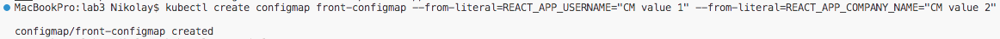
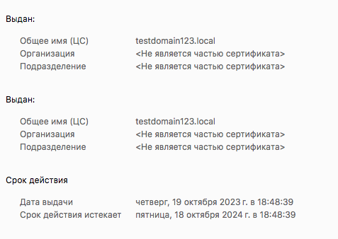

University: [ITMO University](https://itmo.ru/ru/)
Faculty: [FICT](https://fict.itmo.ru)
Course: [Introduction to distributed technologies](https://github.com/itmo-ict-faculty/introduction-to-distributed-technologies)
Year: 2023/2024
Group: K4112c
Author: Timonenko Nikolay Alexandrovich
Lab: Lab3
Date of create: 19.10.2023
Date of finished: 19.10.2023

## Лабораторная работа №3 "Сертификаты и "секреты" в Minikube, безопасное хранение данных."
### Цель работы
Познакомиться с сертификатами и "секретами" в Minikube, правилами безопасного хранения данных в Minikube.
### Ход работы
Запускаем minikube, создаем ConfigMap с переменными REACT_APP_USERNAME = CM value 1, REACT_APP_COMPANY_NAME = CM value 2, просматриваем созданный ConfigMap в формате yaml и сохраняем в файл configmap.yml. В результате получен следующий манифест для ConfigMap.
```
minikube start
kubectl create configmap front-configmap --from-literal=REACT_APP_USERNAME="CM value 1" --from-literal=REACT_APP_COMPANY_NAME="CM value 2"
kubectl get configmap/front-configmap -o yaml
kubectl get configmap/front-configmap -o yaml > configmap.yml
```




Создадим манифест для ReplicaSet, передадим значения переменных из Comfigmap.


Запуск ingress controller
```
minikube addons enable ingress
```


Создаем сертификат с опомщью OpenSSL
```
openssl genrsa -out cert/domain.key 2048
openssl req -key cert/domain.key -new -out cert/domain.csr
openssl x509 -signkey cert/domain.key -in cert/domain.csr -req -days 365 -out cert/domain.crt
```


Создаем Secret с помощью созданного сертификата.
```
kubectl create secret tls tls-secret -o yaml --key=cert/domain.key --cert=cert/domain.crt > secret.yml
```


Создаем и применяем Service для доступа к ReplicaSet, после проверяем, что service создан
```
kubectl expose rs front-replicaset --type=NodePort --port=4549 --target-port=3000 -o yaml > service.yml
kubectl get svc
```


Создаем ingress
```
kubectl create ingress testingress -o yaml --rule=testdomain.com/*=front-replicaset:4549,tsl=tls-secret > ingress.yml
kubectl get ing
```


В результате, поды доступны по адресу [https://testdomain123.local](https://testdomain123.local). Можно просмотреть сертификат и убедиться, что он соответсвует выпущенному нами.




### Схема
