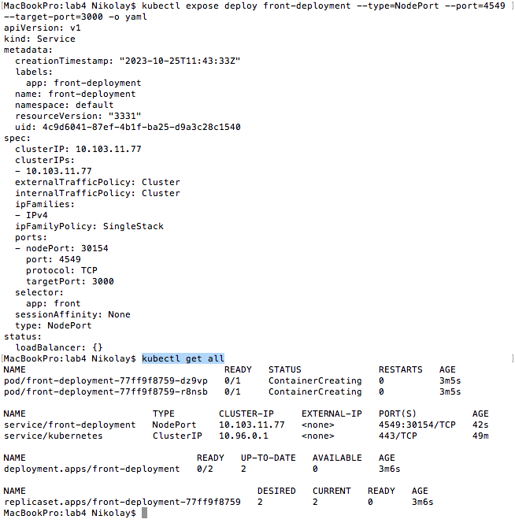

University: [ITMO University](https://itmo.ru/ru/)
Faculty: [FICT](https://fict.itmo.ru)
Course: [Introduction to distributed technologies](https://github.com/itmo-ict-faculty/introduction-to-distributed-technologies)
Year: 2023/2024
Group: K4112c
Author: Timonenko Nikolay Alexandrovich
Lab: Lab4
Date of create: 25.10.2023
Date of finished: 

## Лабораторная работа №4 "Сети связи в Minikube, CNI и CoreDNS""
### Цель работы
Познакомиться с CNI Calico и функцией `IPAM Plugin`, изучить особенности работы CNI и CoreDNS.
### Ход работы
Запуск minikube с устанволенным плагином `Calico` и двумя нодами. Проверям наличие двух нод и наличие плагина Calico.
```
minikube start --nodes 2 --driver=docker --cni=calico --network-plugin=cni
kubectl get nodes
kubectl get pods -l k8s-app=calico-node -A
```


Присвоим запущенных нодам метки на основании географического положения:
```
kubectl get nodes --show-labels
kubectl label nodes minikube location=Europe
kubectl label nodes minikube-m02 location=Asia
kubectl get nodes --show-labels
```


Создадим манифест для `Calico ippool` с распредленеием адресов на основании меток нод.
```
apiVersion: projectcalico.org/v3
kind: IPPool
metadata:
  name: location-europe-ippool
spec:
  cidr: 192.168.0.0/24
  ipipMode: Always
  natOutgoing: true
  nodeSelector: location == "Europe"
---
apiVersion: projectcalico.org/v3
kind: IPPool
metadata:
  name: location-asia-ippool
spec:
  cidr: 192.168.1.0/24
  ipipMode: Always
  natOutgoing: true
  nodeSelector: location == "Asia"
```

Удалим имеющийся IPPool и создадим новые на основе манифеста.
```
kubectl calico delete ippools default-ipv4-ippool --allow-version-mismatch
calico create -f calico.yml --allow-version-mismatch
kubectl calico get ippool --allow-version-mismatch
```


Для деплоймента возьмем манифест из ЛР2, создадим deployment, расширим его сервисом типа NodePort и запустим PortForward:
```
kubectl apply -f front_deployment.yml
kubectl expose deploy front-deployment --type=NodePort --port=4549 --target-port=3000 -o yaml
kubectl get all
kubectl port-forward svc/front-deployment  9000:4549
```





После этого контейнер должен быть доступен по адресу [http://localhost:9000](http://localhost:9000).


Переменные `Container name` и `Container IP` изменяются в зависисмости от пода, куда попал запрос. Для проверки убьем один из подов и проверим значения переменных.
```
kubectl delete pod/front-deployment-77ff9f8759-dz9vp
kubectl port-forward svc/front-deployment  9000:4549
kubectl get pods
```


Как видим значения переменных изменились, таким образом, запрос попал в под, развернутый на другой ноде (видно из диапозона Ip-адреса).

Дополнительно с помощью dashboard проверим размещение подов.
```
minikube dashboard
```


Заходим на под, имеющий ip адрес 192.168.0.65 и имя front-deployment-77ff9f8759-r8nsb, узнаем fqdn второго пода и производим команду ping и traceroute:
```
kubectl exec -it front-deployment-77ff9f8759-r8nsb /bin/sh
nslookup 192.168.1.4
ping 192-168-1-4.front-deployment.default.svc.cluster.local
traceroute 192-168-1-4.front-deployment.default.svc.cluster.local
```


### Схема
